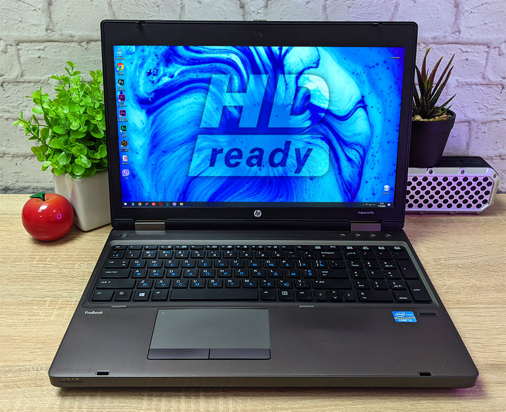
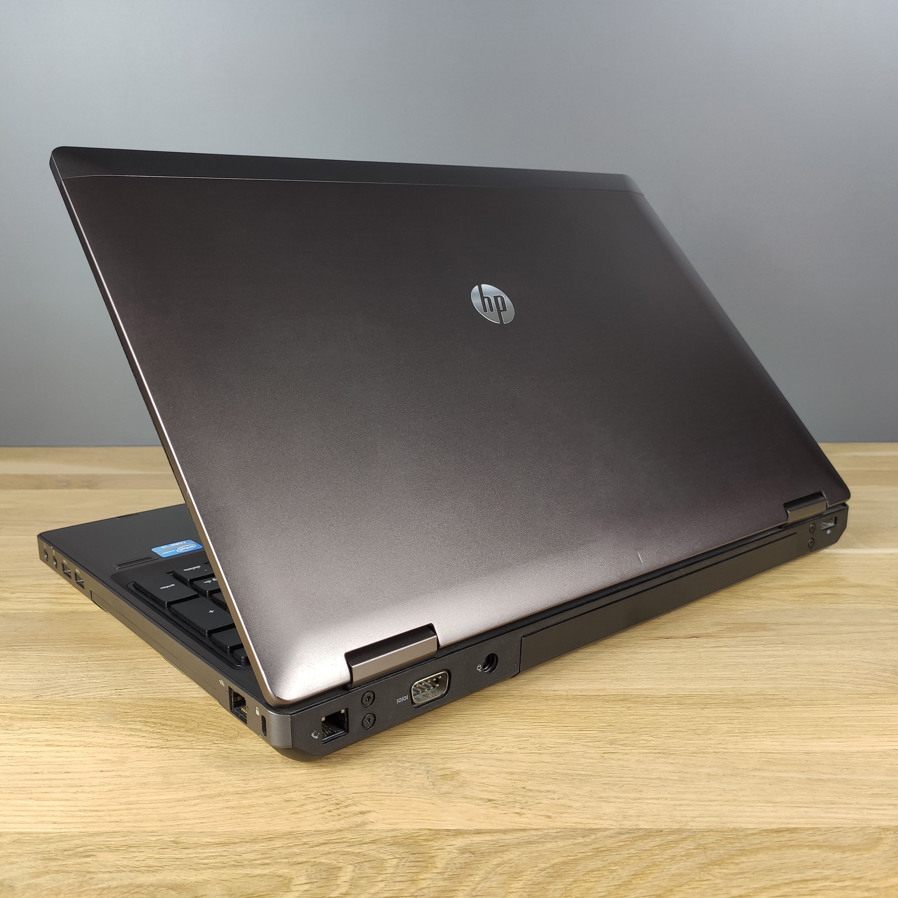

# HP-Probook6570b
Ласкаво просимо до огляду ноутбука HP ProBook 6570b. HP ProBook 6570b стане справжньою знахідкою і для бізнесмена, і для звичайного користувача, яким потрібна зручна в роботі надійна система з широкими комунікаційними можливостями. Ємного акумулятора достатньо для забезпечення роботи тривалий час, ноутбук можна сміливо брати з собою в дорогу. Надійний ноутбук поєднує в собі приємний дизайн та відмінні мультимедіа можливості. Цей комп'ютер оформлений у корпусі сріблястого кольору. Матовий екран, міцність та довговічність, збалансована начинка, гарний функціонал, строгий дизайн, міцний корпус, сканер відбитків пальців, стерео колонки – відмінний ноутбук!

    
    
    

## Характеристики Ноутбука HP ProBook 6570b 
**Серія:** ProBook 6570b 
- **Екран:**
  - Діагональ екрану: 15,6"
  - Частота оновлення екрану: 60 Гц
  - Роздільна здатність: 1600x900
  - Покриття екрану: Матове
- **Відеокарта:**
  - Виробник відеокарти: Intel
  - Тип відеокарти: Інтегрована
- **Накопичувачі:**
  - Тип накопичувача: HDD
  - Об'єм HDD: 750 ГБ
- **Процесор:**
  - Процесор: Intel Core i5-3230M (2.6 ГГц)
  - Кількість ядер процесора	4
- **Операційна система:** Windows 7 Professional
- **Оперативна пам'ять:**
  - Обсяг оперативної пам'яті: 8 ГБ
  - Характеристики оперативної пам'яті: DDR3-1600 МГц
- **Підключення:**
  - Мережеві адаптери: Wi-Fi 802.11 b/g/n, Bluetooth, Gigabit Ethernet
  - Роз'єми та порти введення-виведення: ExpressCard/54, 2 порти USB 3.0, 2 порти USB 2.0, 1 порт eSATA, VGA, DisplayPort, FireWire, LAN, RJ-45, вхід для стереомікрофона, вихід для стереонавушників, лінійний, кард-рідер
- **Корпус:**
  - Колір: Чорний
  - Вага, кг: 2.55
  - Габарити (Ш х Г х В): 374 x 251 x 34 мм
- **Живлення**
  - Тип акумулятора	Li-Ion
  - Ємність акумулятору	4910 Вт/год 
- **Додатково:**
  - З оптичним приводом
  - Веб-камера 720p HD
  - Вбудований мікрофон
    
### Перегляньте відеоогляд на YouTube!
https://youtu.be/OfnoHRi5oQU)

